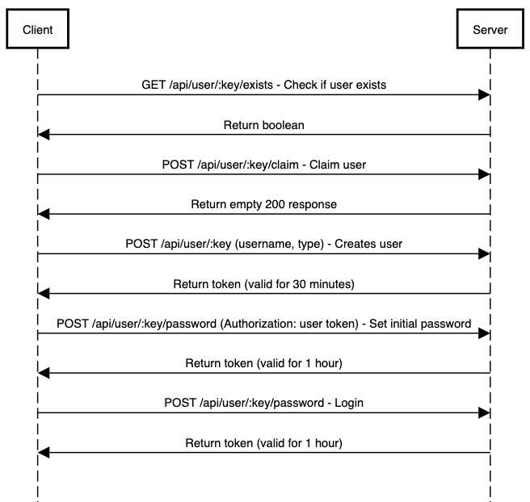

# User Login Process

## Sequence Diagram
```sequence
Client->Server: GET /api/user/:key/exists - Check if user exists
Server->Client: Return boolean

Client->Server: POST /api/user/:key/claim - Claim user
Server->Client: Return empty 200 response

Client->Server: POST /api/user/:key (username, type) - Creates user
Server->Client: Return token (valid for 30 minutes)

Client->Server: POST /api/user/:key/password (Authorization: user token) - Set initial password
Server->Client: Return token (valid for 1 hour)

Client->Server: POST /api/user/:key/password - Login
Server->Client: Return token (valid for 1 hour)
```


## Steps
1. Check if User Exists:
    - The client sends a GET request to `/api/user/:key/exists` to check if the user exists.
    - The server returns a boolean indicating whether the user exists.
2. Claim User:
    - The client sends a POST request to `/api/user/:key/claim` to claim a user.
    - The server validates the claim and returns an empty 200 response on success.
3. User Registration:
    - User fills out the registration form with their key, username, and type.
    - The form submits a POST request to `/api/user/:key` to create a new user.
    - The server returns a token valid for 30 minutes.
    - The client stores the token and username in `sessionStorage`.
4. Set Initial Password:
    - User submits a form to set their initial password.
    - The form submits a POST request to `/api/user/:key/password` using `user {saved token}` as the `Authorization` header.
    - The server validates the password and returns a token valid for 1 hour.
    - The client stores the new token in `sessionStorage`.
5. Client initiates login:
    - User fills out the login form with their key and password.
    - The form submits a POST request to `/api/user/:key/password` **without** the `Authorization` header.
    - The server validates the credentials and returns a token valid for 1 hour.
    - The client stores the token and username in `sessionStorage`.
    - The client also stores the key and password for token refreshing purposes.

## Utility Functions
- **loginUser(key, password)**: Sends a login request and returns the token.
- **saveToken(token)**: Stores the token in `sessionStorage`.
- **saveCredentials(key, password)**: Stores the key and password in `sessionStorage`.
- **getToken()**: Retrieves the token from `sessionStorage` and checks if it has expired. Calls `refreshToken` if necessary.
- **refreshToken()**: Attempts to refresh the token using stored credentials.